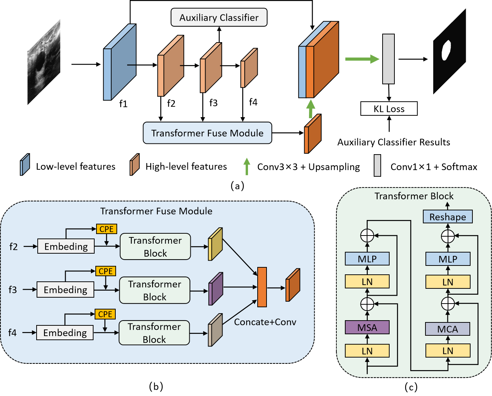
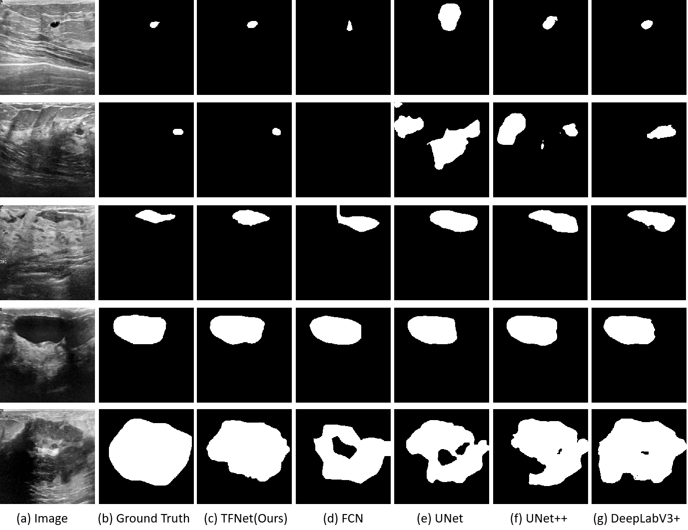

# TFNet

> [ACPR' 22] [TFNet: Transformer Fusion Network for Ultrasound Image Segmentation](https://link.springer.com/chapter/10.1007/978-3-031-02375-0_23).
> 
> Tao Wang, Zhihui Lai and Heng Kong 



# Installation
Please refer to [requirements.txt](requirements.txt)

# Dataset
- Download datasets: [***BUSI***](https://scholar.cu.edu.eg/?q=afahmy/pages/dataset), ***[DDTI](http://cimalab.intec.co/applications/thyroid/)***.

- You can found Processed DDTI dataset in this [link](https://github.com/WAMAWAMA/TNSCUI2020-Seg-Rank1st).

- After downloading the datasets, please change the dataset root path in _configs/\_base\_/datasets_.

# Results

| Model |   Dataset   | Backbone  | Iterations | Batch Size |   DsC    |             Config File             |
| :---: | :---------: | --------- | :--------: | :--------: | :------: | :---------------------------------: |
| TFNet |    BUSI     | ResNet-50 |   40000    |     16     | 77.3±5.5 |  configs/tfnet-r50_256_40k_busi.py  |
| TFNet |    DDTI     | ResNet-50 |   40000    |     16     | 84.6±1.7 |  configs/tfnet-r50_256_40k_ddti.py  |
| TFNet | Our Dataset | ResNet-50 |   40000    |     16     | 87.9±1.4 | configs/tfnet-r50_256_40k_breast.py |

### Visualization




# Reference
- [https://github.com/open-mmlab/mmsegmentation](https://github.com/open-mmlab/mmsegmentation)

# Citation

```bibtex
@inproceedings{wang2022tfnet,
  title={TFNet: Transformer Fusion Network for Ultrasound Image Segmentation},
  author={Wang, Tao and Lai, Zhihui and Kong, Heng},
  booktitle={Asian Conference on Pattern Recognition},
  pages={314--325},
  year={2022},
  organization={Springer}
}
```

